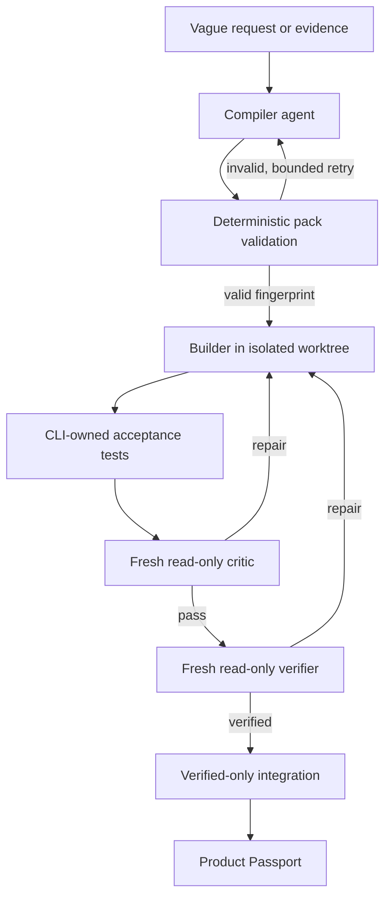
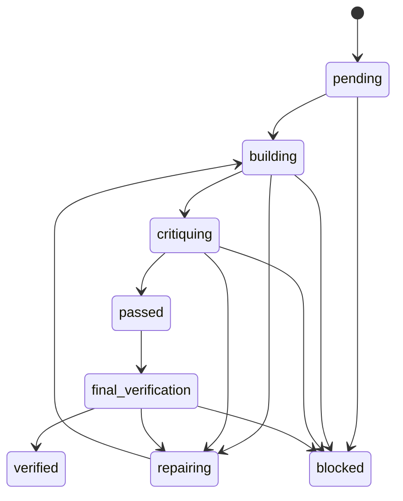

# Architecture

## Lifecycle

## Trust boundaries

| Boundary | Agent decides | Runtime enforces |
|---|---|---|
| Compilation | Intent, evidence interpretation, architecture proposals | Required files, mappings, repair cap, fingerprint |
| Building | Implementation within a slice | Worktree, declared scope, role capability |
| Testing | Nothing about recorded outcomes | Command argv, cwd boundary, timeout, hashes, artifacts, declared assertions |
| Criticism | Semantic pass/repair judgment | Fresh process, read-only permissions, evidence ownership |
| Verification | Falsification and final judgment | Successful independent evidence and legal transition |
| Integration | Nothing | Verified state, unchanged base commit, cherry-pick |
| Release | Artifact preparation | External HMAC authority |

## State machine

Each acceptance test may declare `assertions` — `exit_code`, plus `stdout_`/`stderr_` `equals`, `contains`, or `matches`. The runtime evaluates them when it captures evidence and records a `satisfied` flag; only satisfied evidence can support `passed` or `verified`. A test declaring no assertions still means exit code zero. This lets a pack verify error paths, which a hard-coded exit-code-zero rule cannot express. Unsupported or malformed assertions fail closed so an inert assertion can never read as a pass.

A builder that writes outside its slice's `builder.scope` does not integrate and does not stop the run: the runtime reverts the out-of-scope paths in the worktree and moves the slice `building -> repairing`, so the breach costs one bounded repair instead of wedging the worktree.

Interrupted `building` is resumable: the database retains the state and workspace metadata, and the next invocation dispatches a fresh builder into the existing worktree.

## Persistent artifacts

- `.gauntlet/run-state.sqlite`: transactional state, assignments, evidence index, events, and workspace metadata.
- `.gauntlet/runs/`: CLI-captured evidence artifacts.
- `.gauntlet/product-passport.md`: subject-matter explanation.
- `.gauntlet/product-passport.json`: machine-readable explanation and proof index.
- Temporary `agent-gauntlet-*` Git worktrees: isolated builder attempts, removed after verified integration.

## Supported hosts

- Codex: `codex exec --ephemeral`, JSON Schema output, workspace-write for compiler/builders, read-only for critics/verifiers.
- Claude Code: `claude -p`, JSON Schema output, write tools only for compiler/builders. `--bare` is deliberately not passed: it restricts Anthropic authentication to `ANTHROPIC_API_KEY` or `apiKeyHelper` and never reads an existing interactive login, so every role would fail for subscription users. The cost is that each turn loads hooks, plugins, and discovered `CLAUDE.md`; isolation still comes from a fresh process, the allowed-tool set, and the worktree read-only assertion.
- GitHub Copilot CLI: `copilot -p --no-ask-user`, write and shell tools only for compiler/builders.

Every role starts a new process. Session resume flags are intentionally prohibited across roles.
