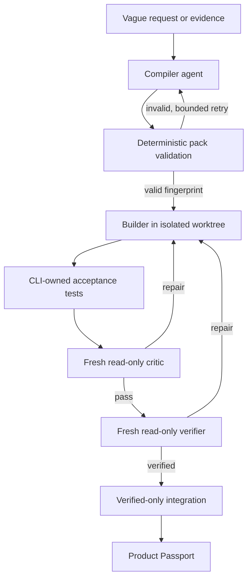
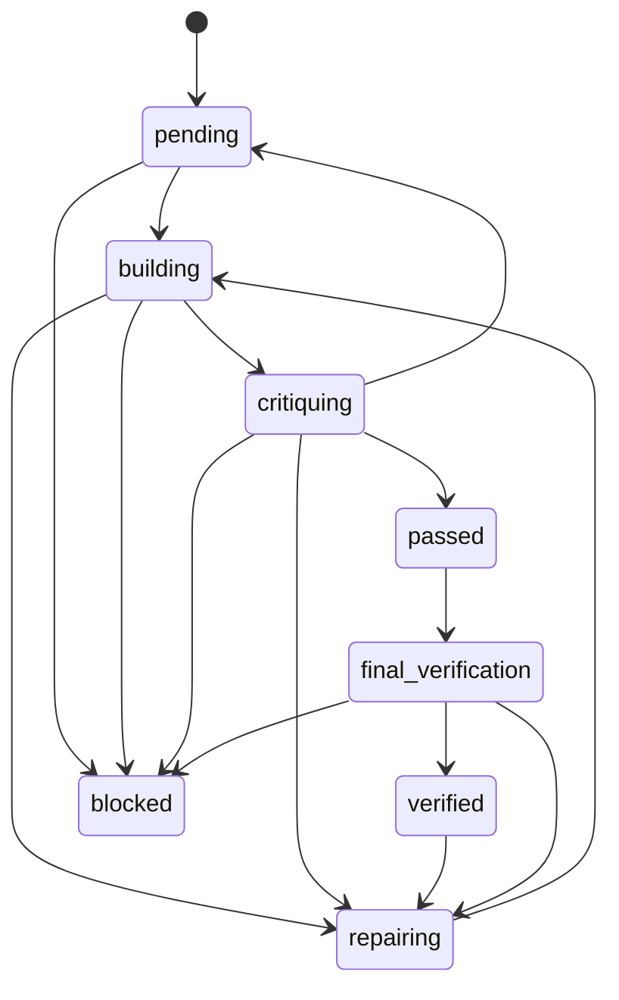

# Architecture

## Lifecycle



## Trust boundaries

| Boundary | Agent decides | Runtime enforces |
|---|---|---|
| Compilation | Intent, evidence interpretation, architecture proposals | Required files, mappings, repair cap, fingerprint |
| Building | Implementation within a slice | Worktree, declared scope, role capability |
| Testing | Nothing about recorded outcomes | Command argv, cwd boundary, timeout, hashes, artifacts, declared assertions |
| Criticism | Semantic pass/repair judgment | Fresh process, read-only permissions, evidence ownership |
| Qualitative judging | Which of two anonymous artifacts is better, and why | Candidate generation, A/B label assignment, neutral staging, panel size, quorum arithmetic |
| Verification | Falsification and final judgment | Clean-room checkouts, repeated runs, reproducibility, legal transition |
| Integration | Nothing | Verified state, unchanged base commit, cherry-pick |
| Release | Artifact preparation | External HMAC authority |

## State machine



## Clean-room final verification

`final-verification.yaml` may declare a clean room, which the runtime performs rather than describes:

```yaml
clean_room: true
runs: 2                       # at least two; one run proves nothing about reproducibility
require_identical_output: false
setup:                        # argv arrays, run once per room before the tests
  - ["npm", "ci"]
```

For each run the runtime creates a detached worktree at the slice's committed head — containing only committed content, with no untracked builder scratch, no installed dependencies, and no caches — executes the declared setup steps there, then runs the acceptance tests and records the evidence. The room is removed afterwards.

This catches the failure a same-worktree re-run cannot: work that passes only because of something never committed. When `require_identical_output` is set, runs must also agree byte for byte, so nondeterminism is a finding even when every run passes. A slice reaches `verified` only if every run satisfied its assertions and the runs agreed; otherwise the summary naming the failure goes back to the builder.

A pack that omits `clean_room: true` keeps the previous behaviour — one run in the existing worktree — and the verifier is told which of the two it got.

## Judging quality, not only correctness

An acceptance test proves a program behaves. It cannot prove the result is any good. For that, `critic-protocol.yaml` may declare `qualitative` criteria, each naming a **reference bar** — a real artifact the work must beat — and the argv command that produces the candidate:

```yaml
qualitative:
  judges: 3               # at least three
  agreement: 0.66         # fraction that must agree; 0.67 across 3 judges means all 3
  criteria:
    - id: home-polish
      slice_id: ui
      question: Which reads as the more polished, trustworthy product?
      candidate: ["node", "scripts/screenshot.mjs"]
      artifact: out/home.png
      reference: reference/linear-home.png
      allow_tie: false
```

A slice with criteria cannot pass on acceptance tests alone. After the tests pass, the runtime runs the candidate command, stages the candidate and the bar in a temporary directory under neutral names `A` and `B`, and dispatches `judges` independent read-only processes that see the two paths and the question — no objective, no slice, no builder rationale, no provenance. The CLI chooses which artifact wears which label from a recorded nonce, so no judge can infer which side is the incumbent, and the tally is arithmetic the runtime performs on individual votes: a judge reports what it saw and has no field in which to declare consensus.

Outcomes are `won` (candidate reaches quorum), `lost` (the bar reaches quorum, sending the slice back to its builder), and `inconclusive` — a divided panel, or a judge that failed to answer. Inconclusive is never approval. Each comparison is written to `.gauntlet/runs/` with both digests, the label mapping, and every vote.

The runtime deletes a candidate artifact it generated, so a later builder checkpoint does not read it as an out-of-scope change.

Each acceptance test may declare `assertions` — `exit_code`, plus `stdout_`/`stderr_` `equals`, `contains`, or `matches`. The runtime evaluates them when it captures evidence and records a `satisfied` flag; only satisfied evidence can support `passed` or `verified`. A test declaring no assertions still means exit code zero. This lets a pack verify error paths, which a hard-coded exit-code-zero rule cannot express. Unsupported or malformed assertions fail closed so an inert assertion can never read as a pass.

A slice cannot repair a defect it is forbidden to touch. When a builder or critic proves the fault lies in an upstream slice, it returns `blocking_slice`; the runtime reopens that slice (`verified`/`passed` -> `repairing`), discards the dependent's worktree, and returns the dependent to `pending`, because the upstream fix moves the base its work was built on. Only a transitive ancestor may be reopened, so a slice can neither blame a dependent nor invent an owner, and the reopened slice pays the repair — when its budget is exhausted the dependent blocks instead of looping.

A builder that writes outside its slice's `builder.scope` does not integrate and does not stop the run: the runtime reverts the out-of-scope paths in the worktree and moves the slice `building -> repairing`, so the breach costs one bounded repair instead of wedging the worktree.

Interrupted `building` is resumable: the database retains the state and workspace metadata, and the next invocation dispatches a fresh builder into the existing worktree.

## Running slices concurrently

`manifest.execution.maximum_parallel_builders` is the ceiling on how many slices hold an agent turn at once. It must be an integer between 1 and 8, and a pack that omits it runs one slice at a time — a pack compiled against serial execution keeps it.

The scheduler dispatches one state transition per slice per turn. A slice is eligible when it is not already in flight, not terminal, and either mid-state or `pending` with every dependency in `passed`, `final_verification`, or `verified`. Nothing shared is mutated: each slice owns its worktree, its evidence rows, and its own state, and no step transitions a slice other than its own. `--max-turns` counts dispatched steps, so it still bounds total agent turns rather than scheduler iterations.

Concurrency is bounded by cost, not only by safety. Each builder is a full agent process, so N of them multiply token spend and memory by N; they shorten wall-clock, not the bill.

Three consequences are handled explicitly rather than left to timing:

- **Git operations stay serialized.** Every call in `workspaces.js` is `spawnSync`, which blocks the event loop for its duration, so two slices can never interleave `git worktree add` on the same repository. This is load-bearing: converting those calls to asynchronous spawn requires introducing a mutex first.
- **A moved base sends the slice back through the clean room.** A sibling that integrates first moves the base a slice was verified against. Integration is therefore attempted *before* `verified` is recorded; on `INTEGRATION_BASE_MOVED` the runtime replays the slice onto the new base and leaves it in `final_verification`, so the clean room runs again against the combined tree. A pass is never recorded for a tree no clean room saw.
- **An upstream reopen never lands under a live builder.** If `blocking_slice` names a slice another step is currently running, the dependent is parked to `pending` immediately and the owner's `-> repairing` transition is queued until that step settles. The dependent stays out of the scheduler until the queued reopen has been applied.

## When a run stops

Every stop writes `.gauntlet/blocker.md` and `.gauntlet/blocker.json` before the error propagates, because `Repair limit exceeded (3)` is not an explanation to hand a subject-matter expert.

The runtime assembles the facts — slice states, repair counts, which declared tests were left unsatisfied and which assertion each missed, comparison outcomes, and the full attempt history — so an agent cannot misreport what happened. A fresh read-only escalation agent then writes the human-facing judgment on top of them: classification, what was attempted, what stopped it in plain language, a recommendation, its trade-off, and what happens if nobody acts.

`human_dependency` is a closed set — `credentials`, `access`, `spending`, `authority`, `legal`, `value_conflict`, `none` — which is how the escalation rule stops being prose. A human may be asked for authority, access, money, or a value call. When what remains is a technical judgment the dependency is `none`, and the runtime blanks the question rather than printing it: the reader is told plainly that no decision of theirs can unblock the run. If the escalation agent itself fails, the recorded facts are still written without the narrative.

## Persistent artifacts

- `.gauntlet/run-state.sqlite`: transactional state, assignments, evidence index, events, and workspace metadata.
- `.gauntlet/runs/`: CLI-captured evidence artifacts.
- `.gauntlet/product-passport.md`: subject-matter explanation of a completed run.
- `.gauntlet/blocker.md` and `.gauntlet/blocker.json`: why a stopped run stopped, and what — if anything — is being asked of the human.
- `.gauntlet/product-passport.json`: machine-readable explanation and proof index.
- Temporary `agent-gauntlet-*` Git worktrees: isolated builder attempts, removed after verified integration.

## Supported hosts

- Codex: `codex exec --ephemeral`, JSON Schema output, workspace-write for compiler/builders, read-only for critics/verifiers.
- Claude Code: `claude -p`, JSON Schema output, write tools only for compiler/builders. `--bare` is deliberately not passed: it restricts Anthropic authentication to `ANTHROPIC_API_KEY` or `apiKeyHelper` and never reads an existing interactive login, so every role would fail for subscription users. The cost is that each turn loads hooks, plugins, and discovered `CLAUDE.md`; isolation still comes from a fresh process, the allowed-tool set, and the worktree read-only assertion.
- GitHub Copilot CLI: `copilot -p --no-ask-user`, write and shell tools only for compiler/builders.

Every role starts a new process. Session resume flags are intentionally prohibited across roles.
